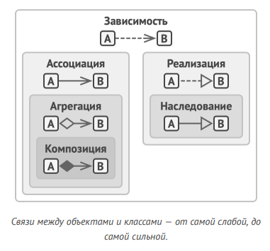

### Краеугольные камни ООП

### Абстракция
- **Абстракция** — выделение значимых характеристик объекта, игнорируя несущественные детали, что упрощает взаимодействие с объектами.  

### Инкапсуляция
- **Инкапсуляция** — скрытие внутренней реализации объекта и предоставление доступа только через интерфейсы, что повышает безопасность данных. 
- Python это достигается с помощью публичных, защищённых (с одним подчеркиванием)  **_protected** и приватных (с двумя подчеркиваниями) **__private** атрибутов и методов.

### Наследование
- **Наследование** — создание новых классов на основе существующих, позволяя повторно использовать код и организовывать иерархию.

### Полиморфизм
- **Полиморфизм** — способность объектов разных типов обрабатывать одно и то же сообщение по-разному, что делает программы гибкими.

---

### Типы связей между объектами

### Зависимость
- **Зависимость** — временное использование одного объекта другим, где один объект нуждается в другом для выполнения действий, но без постоянной связи.

### Ассоциация
- **Ассоциация** — связь между объектами, которые могут существовать независимо, но взаимодействуют друг с другом.

### Агрегация
- **Агрегация** — это тоже связь между объектами, но при этом части могут существовать без целого, и целое может содержать части.

### Композиция
- **Композиция** — это особый вид связи между объектами, при котором один объект является составной частью другого, и их жизненные циклы связаны. Если целый объект уничтожается, то его составные части (объекты, которые являются его частью) также уничтожаются.
- Английская фраза «object composition» значит буквально состоящий из объектов

### Реализация
- **Реализация** — процесс, при котором класс или объект предоставляет конкретное поведение для интерфейса или абстрактного класса, выполняя его методы.
- 
### Наследование
- **Наследование** — механизм, при котором один класс может унаследовать свойства и методы другого класса, что позволяет переиспользовать код и добавлять новые функции.

